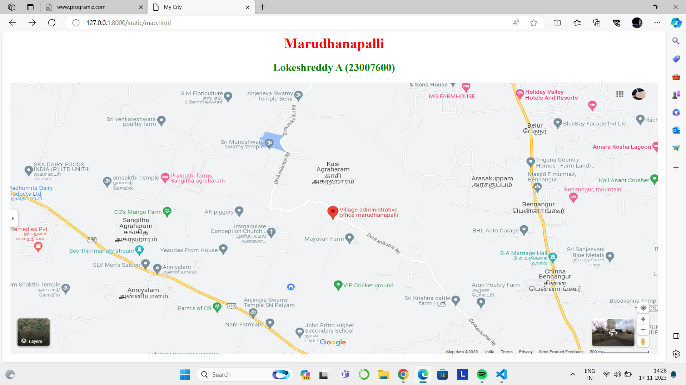

# Ex04 Places Around Me
## Date: 20.11.2023
## AIM
To develop a website to display details about the places around my house.

## DESIGN STEPS

### STEP 1
Create a Django admin interface.

### STEP 2
Download your city map from Google.

### STEP 3
Using ```<map>``` tag name the map.

### STEP 4
Create clickable regions in the image using ```<area>``` tag.

### STEP 5
Write HTML programs for all the regions identified.

### STEP 6
Execute the programs and publish them.

## CODE
```
map.html

<html>
<head>
<title>My City</title>
</head>
<body>
<h1 align="center">
<font color="red"><b>Marudhanapalli</b></font>
</h1>
<h2 align="center">
<font color="green"><b>Lokeshreddy A (23007600)</b></font>
</h2>
<center>

<map name="MyCity">
<area shape="rect" coords="850,350,750,300" href="home.html" title="My Home Town">
<area shape="rect" coords="570,230,45" href="temple.html" title="Anjineya Swamy Temple SN Palyam">
<area shape="rect" coords="850,350,750,300" href="cricket.html" title="VIP Cricket ground">
<area shape="rect" coords="850,350,750,300" href="school.html" title="John Britto Higher Secondary school">
<area shape="rect" coords="850,350,750,300" href="farm.html" title="Mayavan farm">
</map>
</center>
</body>
</html>

home.html

<html>
<head>
<title>My Home Town</title>
</head>
<body bgcolor="orange">
<h1 align="center">
<font color="red"><b>Marudhanapalli</b></font>
</h1>
<h2 align="center">
<font color="black"><b>Marudhanapalli - My Home Town</b></font>
</h2>
<hr size="3" color="red">
<p align="justify">
<font face="Georgia" size="5">
Villages often preserve and pass down traditional customs and cultural practices from generation to generation. Festivals, rituals, and ceremonies are integral parts of village life, contributing to a rich tapestry of cultural heritage. These traditions can strengthen the sense of identity and belonging among the villagers.Villages are typically surrounded by natural landscapes, such as fields, forests, rivers, or mountains. The environment is often serene and picturesque, contributing to a sense of tranquility and connection to nature. The natural surroundings also play a practical role in supporting agricultural activities and providing resources for the community.
</font>
</p>
</body>
</html>

temple.html

<html>
<head>
<title>My Home Town</title>
</head>
<body bgcolor="yellow">
<h1 align="center">
<font color="brown"><b>Marudhanapalli</b></font>
</h1>
<h2 align="center">
<font color="orange"><b>Anjineya Swamy Temple SN Palyam</b></font>
</h2>
<hr size="3" color="red">
<p align="justify">
<font face="Georgia" size="5">
Lord Hanuman is a prominent deity in Hinduism and is revered for his unwavering devotion to Lord Rama. Temples dedicated to Lord Hanuman can be found in various parts of the world, and the name "Anjineya Swamy Temple" could be associated with one such temple.Hanuman temples can be found throughout India and in various other countries with Hindu communities. These temples vary in size and architectural style. Devotees visit these temples to offer prayers, seek blessings, and express their devotion to Lord Hanuman.Hanuman is often depicted as a monkey god, symbolizing strength, agility, and unwavering devotion. His role in the Hindu epic Ramayana, where he plays a crucial part in the rescue of Sita, adds to his significance in the Hindu pantheon.
</font>
</p>
</body>
</html>

cricket.html

<html>
<head>
<title>My Home Town</title>
</head>
<body bgcolor="pink">
<h1 align="center">
<font color="blue"><b>Marudhanapalli</b></font>
</h1>
<h2 align="center">
<font color="green"><b>VIP Cricket ground</b></font>
</h2>
<hr size="3" color="red">
<p align="justify">
<font face="Georgia" size="5">
A cricket group could refer to a sports team or club that plays the game of cricket. Cricket is a popular sport in many countries, and teams can range from local and amateur clubs to professional and international teams. Players in a cricket group often practice and compete together in various formats of the game, such as Test matches, One Day Internationals (ODIs), and Twenty20 (T20) matches.Some organizations or communities are dedicated to supporting a particular cricket team or player. These fan clubs, often referred to as cricket groups, bring together fans who share a common passion for a specific team or player. They may organize events, share updates, and celebrate the successes of their favorite cricket entities.
</font>
</p>
</body>
</html>

school.html

<html>
<head>
<title>My Home Town</title>
</head>
<body bgcolor="red">
<h1 align="center">
<font color="cyan"><b>Marudhanapalli</b></font>
</h1>
<h2 align="center">
<font color="white"><b>John Britto Higher Secondary school</b></font>
</h2>
<hr size="3" color="red">
<p align="justify">
<font face="Georgia" size="5">
John Britto is a co-educational school which encompasses Primary, Secondary and Higher secondary level of education. It was established in 2007 with a vision to provide students standard education at affordable cost.John Britto Matric. Higher Secondary School had a humble beginning, but the tireless effort of the management and the staff brought a very fast growth leading the school to one of the most sought after Matric schools in the Omalur - Kamalapuram region. It's fame reached the peak all over Tamilnadu when it got the state level ranks. From the beginning of the Board Examinations , John Britto excels in getting centum results both in 10th and 12th standards.Education is the most important discovery of mankind. It is the basic factor for the development of our civilization. John Britto is the place that processing various skills, acquisition of knowledge, beliefs, values and habits. We guide our students in the light to the path of success. As our motto says our teachers are working tremendously hard to make our students life shine and they did it.
</font>
</p>
</body>
</html>

farm.html

<html>
<head>
<title>My Home Town</title>
</head>
<body bgcolor="violet">
<h1 align="center">
<font color="red"><b>Marudhanapalli</b></font>
</h1>
<h2 align="center">
<font color="blue"><b>Mayavan farm</b></font>
</h2>
<hr size="3" color="red">
<p align="justify">
<font face="Georgia" size="5">
Farms are primarily areas of land where crops, livestock, or both are raised for food, fiber, or other agricultural products. They play a crucial role in the production of the world's food supply.Many modern farms are adopting sustainable farming practices to minimize environmental impact. This includes practices such as organic farming, agroecology, and conservation agriculture, which aim to promote long-term soil health and biodiversity.Farms are often integral to rural communities, providing employment opportunities and contributing to the local economy. The well-being of these communities is closely tied to the success and sustainability of farming activities.
</font>
</p>
</body>
</html>

```

## OUTPUT

.png>)
.png>)
.png>)
.png>)
.png>)

## RESULT
The program for implementing image maps using HTML is executed successfully.
